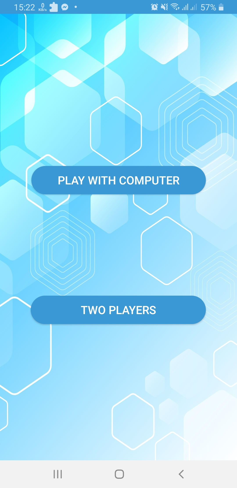
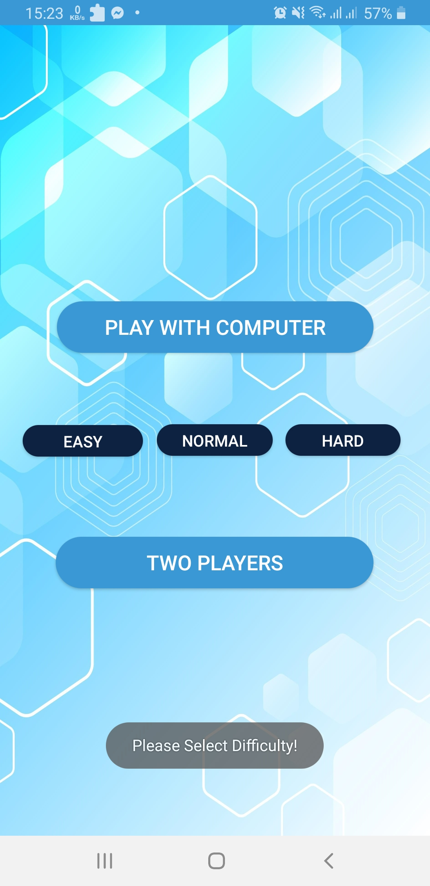
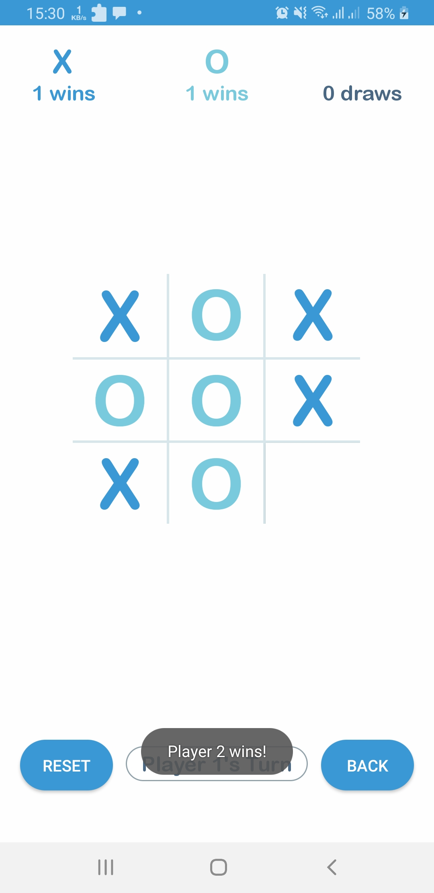
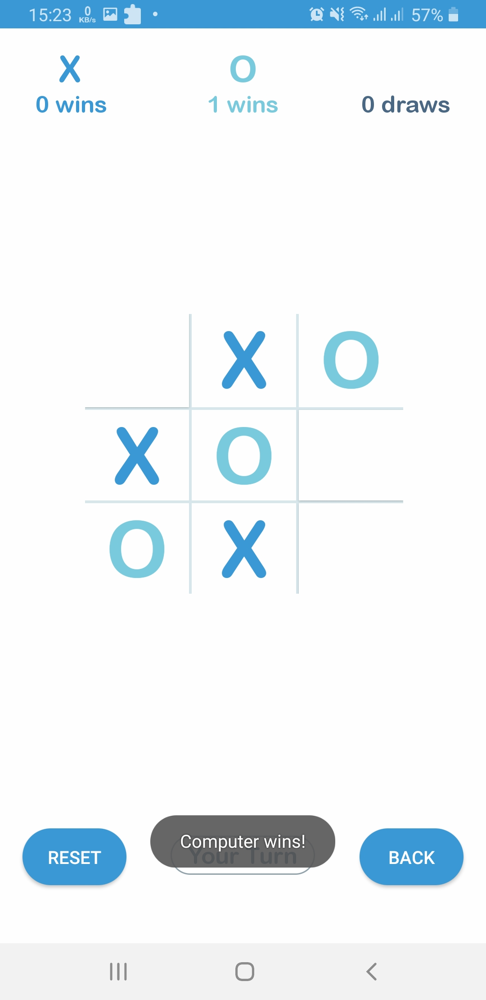

# TicTacToe

TicTacToe is a simple paper-and-pencil game where two players take turn marking the spaces in a three by three grid with X or O. The player who succeeds in placing three of their marks in a horizontal, vertical, or diagonal row is the winner.

<big><strong>Technical Details:</strong></big>
<ul>
<li>Language: Java</li>
<li>Min SDK: 7.1.2</li>
<li>Algorithm: Minimax in Game Theory</li>
</ul>

<big><strong>Features:</strong></big>
<ol>
<li>Multiplayer</li>
<li>Playing with Computer</li>
  <ul>
    <li>Easy mode</li>
    <li>Normal mode</li> 
    <li>Hard mode</li> 
   </ul>
</ol>

<big><strong>Screenshots:</strong></big>

  
   
  
 
  
  
 

<big><strong>How to install:</strong></big>
<ul>
   <li>Go to <a href="https://github.com/zunayed76/TicTacToe/tree/master/APK">this folder</a></li>
   <li>Download app-debug.apk on your android device</li> 
   <li>Give permission to install from unknown sources</li>
   <li>Install and enjoy!</li>
 </ul>

